# Cyberpunk RED Schema for Helix

Полноценная реализация настольной игры Cyberpunk RED внутри фреймворка Helix. Включает все системы оригинальной НРИ, кастомный генератор персонажей и уникальный интерфейс в стиле киберпанк. К сожалению сервер закрыт с 2020 года, поэтому выкладываю режим на всеобщее обозрение.

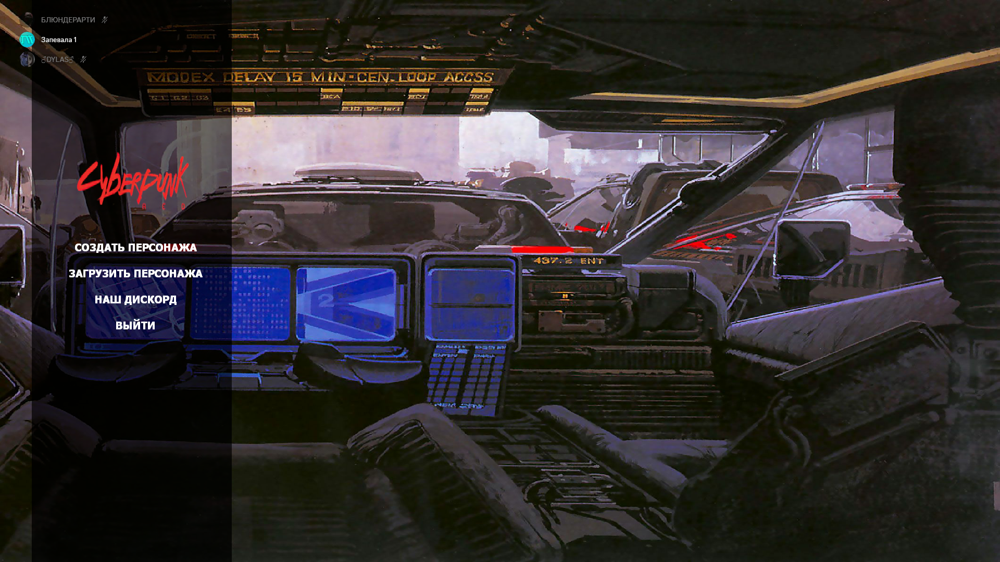
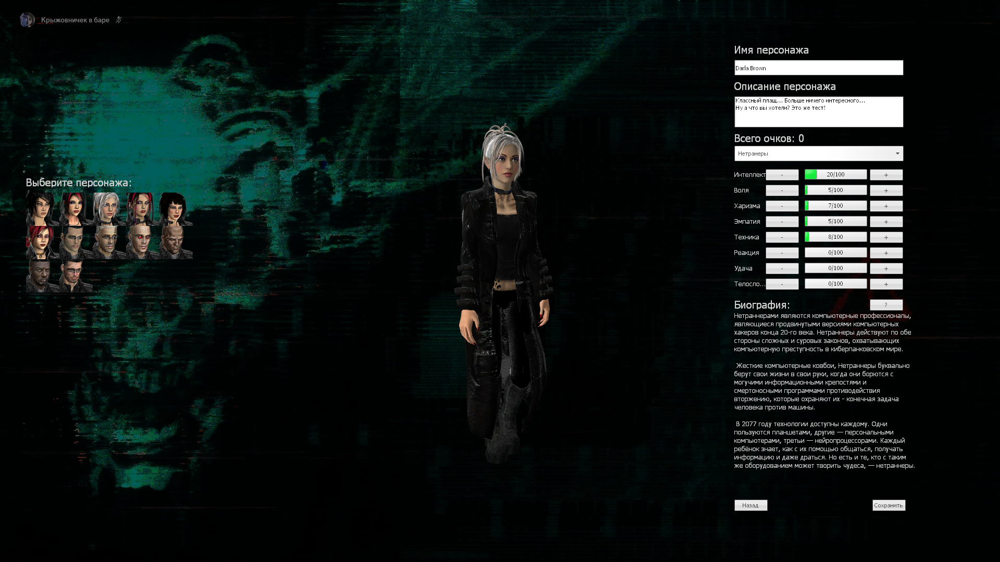
> Интерфейс создания персонажа ранней версии 0.1, уже неактуален.

## Особенности
- 🃏 **Переделанная уникальная карта**
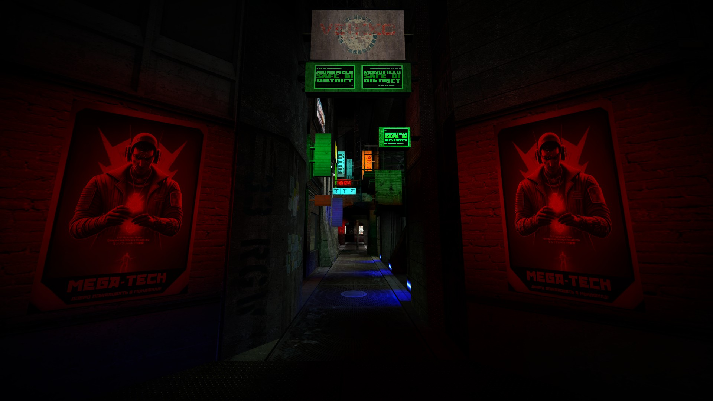
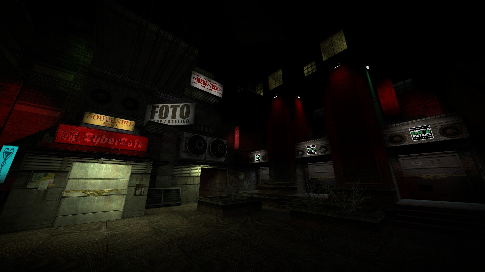
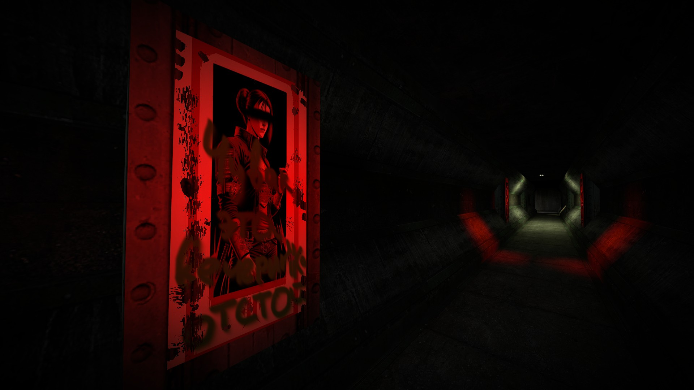
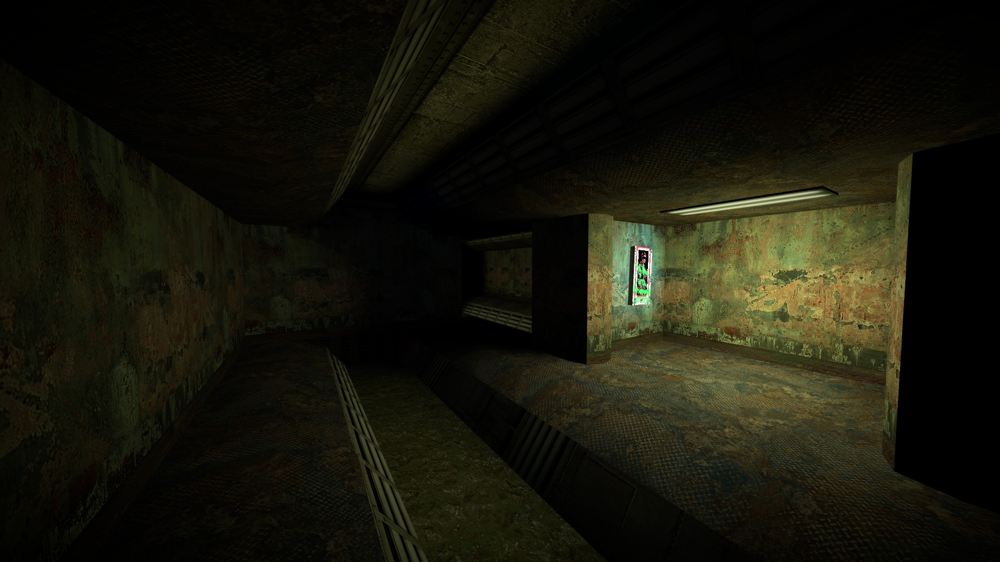
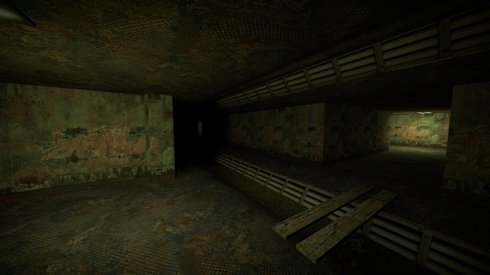
- 🎮 **Полноценный пошаговый бой** с системой инициативы
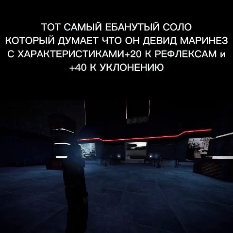
- 👤 **Генератор персонажей** с кастомизацией:
  - Жизненный путь
  - Скиллы и стили боя
  - Уникальные перки
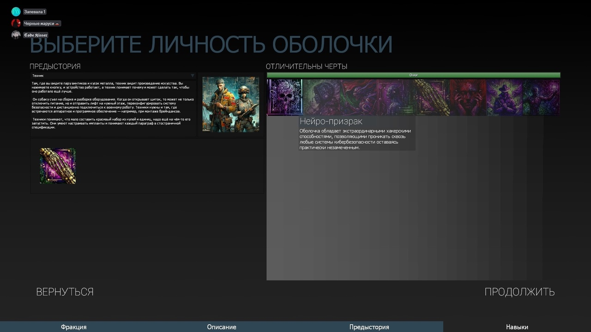
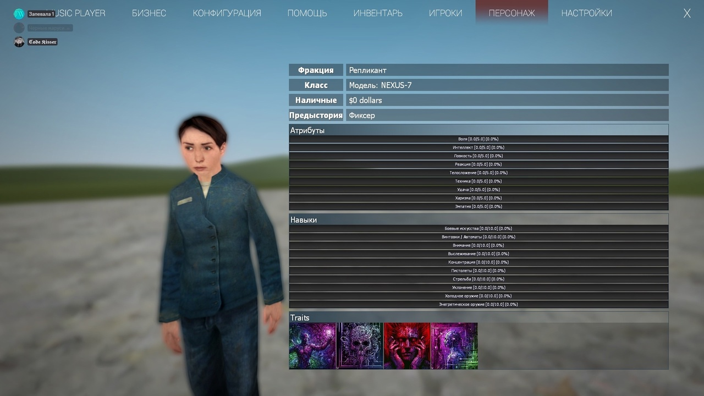
- 💥 Реализация всех игровых систем:
  - Пошаговая система боя на манер НРИ
  - Киберпсихоз и болезни
  - Система медицины и имплантов
- 🖥️ Уникальный ASCII-интерфейс в стиле киберпанк
- 🎲 Автоматические броски дайсов
- 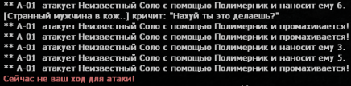

## Установка
1. Склонируйте репозиторий в `~/garrysmod/gamemodes/`
2. Не заабудьте установить Helix и аддоны из коллекции (ссылки внизу).

## Важное примечание
⚠️ **Режим создавался на раннем этапе моего обучения программированию.**  
Код содержит:
- Неоптимальные архитектурные решения
- "Spaghetti code"
- Нарушение всех известных паттернов проектирования  
**Идеальный пример того, как не надо писать код!** 😅

## Поддержка и обсуждение
Весь контент и коллекция режима доступны в Discord:  
  

🔹 **Файлы и обсуждение в канале:** `#your-craft`  
🔹 **По вопросам/багам:** `#discussions`

*Режим создан фанатом для фанатов. Не аффилирован с R. Talsorian Games.*
